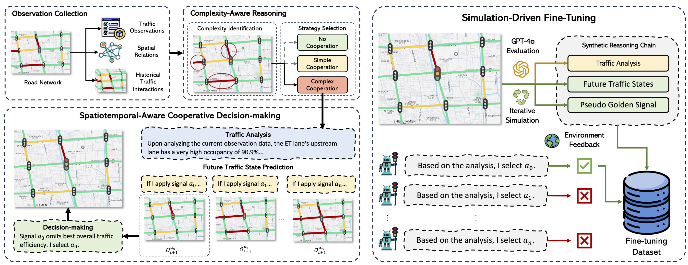

# CoLLMLight: Cooperative Large Language Model Agents for Network-Wide Traffic Signal Control

<a id="Introduction"></a>
## 1 Introduction

Official code for article "CoLLMLight: Cooperative Large Language Model Agents for Network-Wide Traffic Signal Control".

Traffic Signal Control (TSC) plays a critical role in urban traffic management by optimizing traffic flow and mitigating congestion. While Large Language Models (LLMs) have recently emerged as promising tools for TSC due to their exceptional problem-solving and generalization capabilities, existing approaches fail to address the essential need for inter-agent coordination, limiting their effectiveness in achieving network-wide optimization. To bridge this gap, we propose \textbf{CoLLMLight}, a cooperative LLM agent framework for TSC. 
Specifically, we first construct a structured spatiotemporal graph to capture real-time traffic dynamics and spatial relationships among neighboring intersections, enabling the LLM to reason about complex traffic interactions.
Moreover, we introduce a complexity-aware reasoning mechanism that dynamically adapts reasoning depth based on real-time traffic conditions, ensuring optimal computational efficiency without sacrificing decision quality.
Besides, we propose a fine-tuning strategy that leverages iterative simulation-driven data collection and environmental feedback to build a lightweight LLM tailored for cooperative TSC. 
Extensive experiments on both synthetic and real-world datasets demonstrate that CoLLMLight outperforms state-of-the-art methods in diverse traffic scenarios, showcasing its effectiveness, scalability, and robustness.



<a id="requirements"></a>
## 2 Requirements

`python>=3.9`,`tensorflow-cpu=2.8.0`, `cityflow`, `pandas=1.5.0`, `numpy=1.26.2`, `wandb`,  `transformers=4.48.2`, `vllm`, `lmdeploy`

[`cityflow`](https://github.com/cityflow-project/CityFlow.git) needs a linux environment, and we run the code on Ubuntu.

<a id="Usage"></a>
## 3 Quick Start
First, deploy a LLM server through `lmdeploy`
```shell
lmdeploy serve api_server YOUR_LLM_PATH --tp=YOUR_GPU_NUM
```
Then, run the CoLLMLight with open
```shell
python run_CoLLMlight.py --model_path=YOUR_LLM_PATH --dataset='newyork_28x7' --traffic_file='anon_28_7_newyork_real_double.json'
```